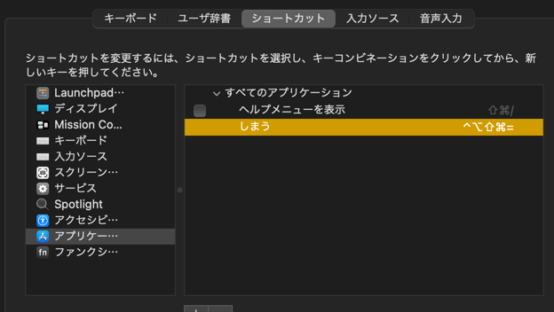

# macOSの環境構築

## アプリのインストール

- Google Chrome
- Google IME
- Slack
- irerm
- Visual Studio Code
- Xcode(Apple Storeからダウンロードしてインストール)
- Rectangle
- Clipy
- Karabiner-Element
- カスペルスキー
- Just Forcus（ポモドーロテクニックアプリ）
- Itsycal(メニューバーカレンダーアプリ)
- Google IEM
- Wally(Ergodoxの設定アプリ)
- OnyX
- Intellij Toolbox
- twitter
- discord
- focus to-do
- office excel powerpoint
- kindle
- docker
- onyx
- MindNode

## カスペルスキー

アクティベーションコードをいれる

## Macのシステム環境設定

### キーボードショートカット

**Mission Control**

- 最新の使用状況に基づいて操作スペースうを自動で並び替える -> チェック外す
- ウィンドウをアプリケーションごとにグループ化

**Siri**

無効化

**XXXXXXXXX**
TODO 書く


## Karabinerの設定

いれたけど特に設定無し


## itermの設定

### 1. カラーを変更

profile -> new Profile

### 2. Command + Enterで最大化されるのを無効にする

Keys -> Key Bindings -> +ボタン -> ´´´CMD +  ENTER´´´ is disabled`

### 3. バッファーの行数を増やす

Profiles -> Terminal -> Scrollback Buffer
1,00000


## workディレクトリの作成

```zsh
mkdir 会社名
```

## zshの設定

↓を参照

.zshrc
.zsh_profile

## gitconfig

↓を参照

.gitconfig

### グローバルなgitignore

touch ~/.gitignore_global

```zsh
.DS_Store
```

```zsh
$ git config --global core.excludesFile ~/.gitignore_global
```

参考

https://qiita.com/takuya0301/items/29187aa088d04cf92659


## SSHの設定

.ssh/をコピペして、chmod 700を設定する

参考

```zsh
ssh-keygen -t rsa -b 4096 -C "72484465+makoto-engineer@users.noreply.github.com"
```

エンター連打
```
Generating public/private rsa key pair.
Enter file in which to save the key (/Users/iguchi_takashi/.ssh/id_rsa):
Created directory '/Users/iguchi_takashi/.ssh'.
Enter passphrase (empty for no passphrase):
Enter same passphrase again:
Your identification has been saved in /Users/iguchi_takashi/.ssh/id_rsa.
Your public key has been saved in /Users/iguchi_takashi/.ssh/id_rsa.pub.
The key fingerprint is:
SHA256:wbTmcTSRnDBvhSGX8lk3cGzPc/KPLyAHBvlbms9yvSw 72484465+makoto-engineer@users.noreply.github.com
The key's randomart image is:
+---[RSA 4096]----+
|        =+*Boo.  |
|       o =* . ..+|
|   o    *=+o o + |
|           = o ..|
|        *=+o o + |
|      po .o+    .|
|        S. *   oo|
|          . E.+ .|
|           o .o+.|
+----[SHA256]-----+
```

githubに公開鍵を登録する

```zsh
cat ~/.ssh/id_rsa.pub
出力を貼り付ける
```

## vim/Neovimの設定

↓を参照

.vimrc


## brew

こちらを見ながらやる

https://brew.sh/index_ja


```zsh
/bin/bash -c "$(curl -fsSL https://raw.githubusercontent.com/Homebrew/install/HEAD/install.sh)"
```

## Xcodeを入れる

```zsh
sudo xcodebuild -license accept
```


## direvn

```zsh
brew install direnv
```

## nodebrew/Node.js/yarnの設定

こちらを見ながらやる

https://github.com/hokaccha/nodebrew

nodebrewをインストール

```zsh
curl -L git.io/nodebrew | perl - setup
```

.zsh_profileに追加

```
```zsh
vim .zsh_profile

# export PATH=$HOME/.nodebrew/current/bin:$PATH # <- コメントアウトをはずす
```


```zsh
nodebrew ls-remote
```

```zsh
nodebrew install-binary v12.22.3
```

```zsh
nodebrew use v12.22.3
```

## VScode


.vscode/settings.json

```json
{
    "workbench.colorCustomizations": {
        "titleBar.activeBackground": "#4aa1c4",
        "titleBar.activeForeground": "#000000",
        "activityBar.background": "#4aa1c4",
        "activityBar.foreground": "#000000"
    }
}
```

### VSCode 拡張機能

ElixirLS: Elixir support and debugger
Bracket Pair Colorizer
Rainbow CSV
indent-rainbow
Path Intellisense
HTML CSS Support
IntelliSense for CSS class names in HTML
npm
yarn
Draw.io Integration
vim
YAML
Go

## Elixir/Phoenix

asdfでElixir環境を構築

こちらを参照

https://asdf-vm.com/#/core-manage-asdf

macOS -> Homebrew 経由でインストール

```
brew install asdf
or
git clone https://github.com/asdf-vm/asdf.git ~/.asdf --branch v0.8.1
```

macOS -> ZSH -> Git

```
. $HOME/.asdf/asdf.sh
```

プラグインを
プラグインを入れる

```zsh
asdf plugin-add erlang https://github.com/asdf-vm/asdf-erlang.git
asdf plugin-add elixir https://github.com/asdf-vm/asdf-elixir.git
```

### Elixirをインストール

```
asdf list-all elixir
```
最新のElixirを入れる

```zsh
asdf install elixir 1.12.2-otp-24
```

インストール済みのElixirのバージョンを確認

```zsh
asdf list elixir
```

Elixirを使えるようにする

```zsh
asdf global elixir 1.12.2-otp-24
```

### Erlangインストール

elixirと同じく、インストール可能なElixirバージョンを確認

```zsh
asdf list-all erlang
```

最新のErlangを入れる

```zsh
asdf install erlang 24.0.4
```

インストール済みのErlangのバージョンを確認

```zsh
asdf list erlang
```

Erlangを使えるようにする

```zsh
asdf global erlang 24.0.4
```
### 動作確認

.zsh_profileのコメントアウトを外す

```zsh
.  $(brew --prefix asdf)/asdf.sh
```

以下のコマンドが使えるかチェック

```zsh
iex
erl
mix
```

### Phoenix

```zsh
mix archive.install hex phx_new
```
## NeoVIM

neovimの公式ページからダウンロードして実行する

https://github.com/neovim/neovim

```zsh
brew install neovim
```

エラーが起きたら

```
E886: System error while opening ShaDa /xxxxx/xxxxxxxxx/xxxxxxx/nvim/shada/main.shada for reading: permission denied
```

```zsh
sudo chown -R ユーザ名.local/share/nvim
```

## キーリピート設定変更

```
defaults write -g InitialKeyRepeat -int 13
defaults write -g KeyRepeat -int 1
```

緊急時もとに戻す
```
defaults delete -g InitialKeyRepeat
defaults delete -g KeyRepeat
```

## Intellijインストール & 設定

### インストールするアプリ

- toolbox -> 全部管理
- idea -> テキスト or その他
- rubymine -> Ruby Elixir Phoenix
- phpstorm -> PHP 
- webstorm -> React/Vue/Elm
- grip -> MySQL
- goland -> Golang

### 2. プラグイン

**共通**

- vimidea
- rainbow bracket
- intedent rainbow
- rainbow csv
- prettier

**rubymineだけ**

- dark purple thema
- erlang
- elixir


**ideaだけ**

- one dark theam

**webstormだけ**

- Monokai Pro thema
- elm
- intelliVue

**php storm**

- atom dark


### 3. きもいフォントを変える

```zsh
brew tap homebrew/cask-fonts
brew install font-hackgen
brew install font-hackgen-nerd
```


- Editor -> Font
- Font: Hackgin35
- size: 17
- line height: 1


参考: https://github.com/yuru7/HackGen

### 4. ショートカット

vsplit: cmd shift ctrl ↑
split: cmd shift ctrl ↓
source git: cmd 9
open terminal: cmd shift 9
markdown show only editor: cmd shift p


### 5. ファイルの履歴数

Editor -> General -> limits

- Recent file limits: 500
- Recent location limit: 500

### 6. markdownのプレビューが自動で表示されないように修正する


### 7. vimideaの設定をコピる

cp ~/.vimrc ~/.ideavimrc

language Framwork > Default Layout 

Editor onlyに変更

### 7. 差分表示は左右比較をデフォルトにする

TODO


## プロンプトのカスタマイズ

### 5-1. フォントをインストール 

```zsh
# clone
git clone https://github.com/powerline/fonts.git --depth=1
# install
cd fonts
./install.sh
# clean-up a bit
cd ..
rm -rf fonts
```

itermの設定を開き、フォントを´DejaVu Sans Mono Powerline´に設定する


### 5-2 zshの補完をインストール

```zsh
brew install zsh-completions
```

### 5-3 gitの補完

```zsh
# バージョンが違うかもしれないので適宜修正
cp /usr/local/Cellar/git/2.32.0_1/etc/bash_completion.d/git-completion.bash ~/.git-completion.bash
```


### OnyX Macの無駄な設定を根こそぎオフ


**各種設定 -> 一般**

- ウィンドウを開くときにグラフィックエフェクトを表示: off

**各種設定 -> Finder**

- ウィンドウのズーム: off
- 情報ウィンドウのアニメーション: off
- 不可視ファイルの/フォルダを表示: on
- ウィンドウのタイトルにパスを表示: on

**各種設定 -> Dock**

- アニメーション -> アプリケーションの起動: off
- アニメーション -> バックグラウンドの警告: off
- アニメーション -> ディスプレイ -> アニメーションの停止


## Golang インストール

こちらからpkgをインストール: https://golang.org/doc/install


.zsh_profileのコメントアウトを外す


```zsh
# export PATH=/usr/local/go/bin:$HOME/go/bin:$PATH # <- コメントを外す
export PATH=/usr/local/go/bin:$HOME/go/bin:$PATH
```


asdf plugin-add golang https://github.com/kennyp/asdf-golang.git

最新のバージョンをインストール
asdf list all golang

asdf install golang 1.17rc2


```text
awscli
elixir
elm
erlang
gcloud
github-cli
github-markdown-toc
gitui
haskell
helm
httpie-go -> HTTPie
mysql
neovim
nim
nodejs
php
python

rabbitmq
redis
redis-cli
swift
v
vim

```


## Twitter CLI twtyをインストール

インストール方法: https://obel.hatenablog.jp/entry/20200215/1581706800

```zsh
go get github.com/mattn/twty
```

パスを追加

```zsh
export PATH=$HOME/.nodebrew/current/bin:$PATH
export PATH=/usr/local/go/bin:$HOME/go/bin:$PATH #<-- 追記
```

使い方

```zsh
twty おはよう
```

## Reactプロジェクトを操作できるようにする


```zsh
npm i -g yarn
```

## direnv

TODO

## Rust install

こちらを参考: https://www.rust-lang.org/tools/install

```zsh
brew tap helix-editor/helix
brew install helix
```

```
hx
```


## MySQL

mysqlサーバを建てる

```zsh
docker-compose up -d
docker-compose exec db mysql -V
docker-compose exec db bash -c 'mysql -u${MYSQL_USER} -p${MYSQL_PASSWORD} ${MYSQL_DATABASE}'
```

テーブルを見る
show tables from homestead;

テーブルを作る

create table homestead.todo (id int, title varchar(10), type int, contents LONGTEXT);
create table homestead.todo (id int not null auto_increament, title varchar(10), type int, contents LONGTEXT, primary key(id));

データを入れる


## cap

動画キャプチャツール

https://getkap.co/


## 不要なショートカットを無効化

**CMD + mでしまう**
cmd + opt + \/|


## AWSの設定
## GCPの設定
## PostgreSQLの設定
## ghc/Haskellの設定
## elmの設定
## Dockerインストール
## 
## 
## 
## 
